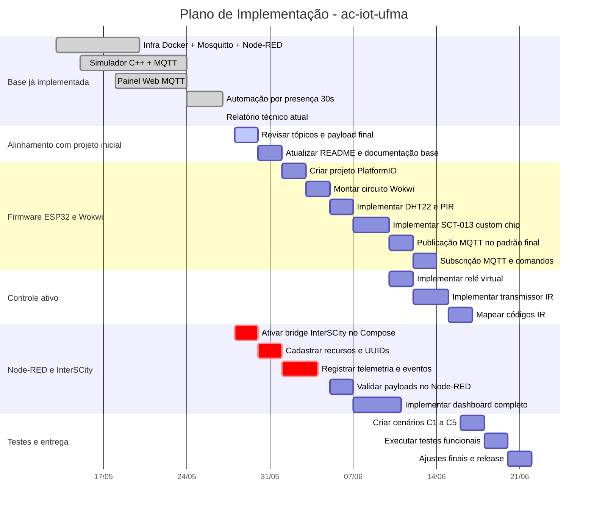

# Status da Implementação e Plano de Gantt

## Base de Comparação

Esta análise foi feita a partir dos documentos iniciais do projeto:

- `projeto_iot_ufma_v2.pdf`
- `implementacao_iot_ufma_v2.pdf`

Os documentos definem uma solução IoT para gestão energética dos ar-condicionados do Prédio Paulo Freire da UFMA, com ESP32 simulado no Wokwi, sensores DHT22/PIR/SCT-013, MQTT, Node-RED, InterSCity, dashboard, relé virtual e transmissor infravermelho.

O repositório atual possui uma adaptação funcional baseada em Docker, Mosquitto, Node-RED, simulador C++ e painel web. A solução atual já valida parte importante da arquitetura distribuída e da comunicação MQTT, mas ainda não cobre integralmente o escopo original baseado em firmware ESP32 + Wokwi + sensores físicos simulados.

---

## 1. Resumo Executivo

### Realizado

- Infraestrutura Docker com Mosquitto, Node-RED e simulador C++.
- Broker MQTT com portas `1883` e `9001` configuradas.
- Simulador C++ de três salas (`sala01`, `sala02`, `sala03`).
- Publicação MQTT periódica de dados ambientais.
- Recepção de comandos MQTT pelo simulador.
- Controle de AC, luz, setpoint, presença e modo de automação.
- Painel web em HTML/JavaScript usando MQTT via WebSockets.
- Fluxo Node-RED com automação básica por temperatura/presença.
- Regra de desligamento por ausência em 30 segundos.
- Estrutura inicial para integração InterSCity em C++.
- Catálogo/documentação inicial para códigos IR.
- Relatório técnico do sistema atual em `docs/RELATORIO_TECNICO.md`.

### Parcialmente Realizado

- Estrutura do repositório existe, mas não segue totalmente a árvore prevista nos PDFs.
- Node-RED possui fluxos e automação, mas ainda não possui dashboard completo com métricas energéticas.
- InterSCity possui bridge local, mas o serviço está comentado no Compose e não há cadastro de recursos/UUIDs.
- Testes existem de forma inicial, mas não há documentação completa dos cinco cenários planejados.
- Simulação de sensores existe no simulador C++, mas não no Wokwi com ESP32, DHT22, PIR e SCT-013.

### Ainda Falta

- Firmware ESP32 com PlatformIO.
- Circuito Wokwi (`diagram.json`, `wokwi.toml`).
- Custom chip SCT-013.
- Leitura real/simulada de corrente e cálculo de potência.
- Estados operacionais completos (`AC_ON`, `AC_ON_COOLING`, `AC_OFF`, `ALERTA_DESPERDICIO`).
- Controle por relé virtual.
- Transmissor IR e mapeamento real de códigos.
- Dashboard Node-RED com gauges, charts, notificações, métricas e controle manual.
- Integração completa com InterSCity.
- Cinco cenários de teste documentados e validados.

---

## 2. Matriz de Status por Etapa

| Etapa | Previsto no plano inicial | Status atual | Evidência no repositório | Falta para concluir |
|---|---|---|---|---|
| 01 | Preparação do ambiente | Parcial | Docker Compose funcional; Mosquitto/Node-RED via container | Validar ambiente original com VS Code, PlatformIO, Wokwi e ferramentas locais |
| 02 | Estruturação do repositório | Parcial | `docs/`, `node-red/`, `interscity/`, `ir-codes/`, `tests/`, `simulador/` | Criar/organizar `firmware/esp32/`, `chips/`, `platformio.ini`, `wokwi.toml`, `diagram.json` |
| 03 | Firmware base ESP32 | Pendente | Não há pasta `firmware/esp32` | Criar projeto PlatformIO, Wi-Fi, MQTT publish/subscribe |
| 04 | Circuito Wokwi | Pendente | Não há `diagram.json` | Modelar ESP32, DHT22, PIR, relé, LED IR e SCT-013 |
| 05 | SCT-013 custom chip | Pendente | Não há `sct013.chip.c/json` | Implementar chip no Wokwi e validar ADC |
| 06 | Leitura/processamento dos sensores | Parcial | Simulador C++ gera temperatura, umidade, luminosidade e presença | Implementar DHT22, PIR, SCT-013, corrente e potência no firmware |
| 07 | Estados do AC e LED | Parcial | Simulador mantém `status_ac`, `modo_ac`; Node-RED aplica regra básica | Implementar enum de estados, corrente, alerta desperdício e LED no firmware |
| 08 | Publicação MQTT estruturada | Parcial | Tópicos `ac-iot/+/sensores` com JSON funcional | Alinhar payload ao plano: `corrente`, `potencia`, `ac_status`, `alerta`; decidir padrão final de tópicos |
| 09 | Subscrição MQTT e comandos | Parcial | Simulador assina `ac-iot/+/comando` e `ac-iot/all/comando` | Implementar comandos originais `rele` e `ir` no firmware ESP32 |
| 10 | Transmissor IR | Pendente | `ir-codes/README.md` documenta formato | Implementar IRremote, GPIO 27, códigos e função de envio |
| 11 | Middleware, controle e dashboard Node-RED | Parcial | `node-red/flows.json` e `docker/nodered/data/flows.json` | Adicionar validação, dashboard, métricas, countdown, gráficos, InterSCity e comandos IR/relé |
| 12 | Integração InterSCity | Parcial | `interscity/main.cpp`, `Dockerfile`, `config.example.env` | Ativar serviço no Compose, cadastrar recursos, armazenar dados/eventos e documentar UUIDs |
| 13 | Refinamento e documentação | Parcial | `docs/RELATORIO_TECNICO.md`, `docs/README.md` | Atualizar README principal, corrigir docs antigas, alinhar tópicos e instruções |
| 14 | Testes funcionais finais | Parcial | `tests/test_mqtt_pub.bat` | Criar `cenario_01.md` a `cenario_05.md`, executar e registrar resultados |

---

## 3. Diferenças Entre Plano Original e Implementação Atual

### Arquitetura prevista

O plano inicial previa como origem dos dados:

```text
ESP32 + Wokwi + DHT22 + PIR + SCT-013
```

Com publicação em:

```text
ufma/paulo-freire/{sala}/ac
```

E controle em:

```text
ufma/paulo-freire/{sala}/controle
```

### Arquitetura implementada atualmente

O projeto atual usa como origem dos dados:

```text
Simulador C++ em Docker
```

Com publicação em:

```text
ac-iot/{sala}/sensores
```

E controle em:

```text
ac-iot/{sala}/comando
ac-iot/all/comando
```

### Avaliação

A implementação atual cumpre bem o papel de protótipo distribuído local, pois demonstra comunicação MQTT, automação, comandos e visualização. Porém, ela ainda não substitui completamente a implementação Wokwi/ESP32 planejada, principalmente nas partes de sensores físicos simulados, corrente elétrica, potência, relé, IR e dashboard energético.

---

## 4. Pendências Prioritárias

### Prioridade Alta

1. Criar firmware ESP32 com PlatformIO.
2. Criar circuito Wokwi com sensores e atuadores.
3. Ativar e validar a comunicação com a InterSCity.
4. Cadastrar recursos/salas e documentar UUIDs na InterSCity.
5. Encaminhar telemetria e eventos de controle para a InterSCity.
6. Implementar payload com corrente, potência, estado do AC e alerta.
7. Completar fluxo Node-RED com validação e regras do projeto inicial.
8. Criar dashboard Node-RED com métricas e controle manual.
9. Documentar e executar os cinco cenários de teste.

### Prioridade Média

1. Implementar e documentar comandos IR.
2. Criar documentação de arquitetura, ambiente, etapas e testes conforme estrutura inicial.
3. Refinar payloads e contratos MQTT após validação com InterSCity.
4. Automatizar testes de integração MQTT/Node-RED/InterSCity.

### Prioridade Baixa

1. Refinar layout visual do painel web.
2. Unificar nomes de salas e tópicos.
3. Adicionar autenticação MQTT.
4. Automatizar testes de integração.
5. Criar release/tag de versão.

---

## 5. Gráfico de Gantt

O gráfico abaixo considera o estado atual em 27/05/2026 e propõe um plano de finalização incremental até 21/06/2026.



---

## 6. Gantt Simplificado por Etapa

| Etapa | Status | Período sugerido |
|---|---|---|
| 01 - Preparação do Ambiente | Parcial/feito via Docker | Concluído parcialmente |
| 02 - Estrutura do Repositório | Parcial | 28/05 a 31/05 |
| 03 - Firmware Base ESP32 | Pendente | 01/06 a 02/06 |
| 04 - Circuito Wokwi | Pendente | 03/06 a 04/06 |
| 05 - SCT-013 Custom Chip | Pendente | 05/06 a 07/06 |
| 06 - Leitura dos Sensores | Parcial | 08/06 a 09/06 |
| 07 - Estados e LED | Parcial | 09/06 a 10/06 |
| 08 - MQTT Sensores | Parcial | 10/06 a 11/06 |
| 09 - MQTT Comandos | Parcial | 11/06 a 12/06 |
| 10 - Transmissor IR | Pendente | 12/06 a 15/06 |
| 11 - Node-RED/Dashboard | Parcial | 05/06 a 12/06 |
| 12 - InterSCity | Parcial / Prioridade Alta | 28/05 a 03/06 |
| 13 - Refinamento/Docs | Parcial | 28/05 a 16/06 |
| 14 - Testes Finais | Parcial | 16/06 a 21/06 |

---

## 7. Recomendações Técnicas

### 7.1 Definir um padrão final de tópicos MQTT

Há divergência entre o plano inicial e a implementação atual.

Plano inicial:

```text
ufma/paulo-freire/{sala}/ac
ufma/paulo-freire/{sala}/controle
```

Implementação atual:

```text
ac-iot/{sala}/sensores
ac-iot/{sala}/comando
```

Recomendação: escolher um padrão único antes de implementar o firmware ESP32, para evitar retrabalho no Node-RED e no painel web.

### 7.2 Manter o simulador C++ como ferramenta de teste

Mesmo que o firmware Wokwi seja implementado, o simulador C++ continua útil para testes rápidos, demonstração e desenvolvimento sem depender do Wokwi.

### 7.3 Priorizar a comunicação com InterSCity

A comunicação com a InterSCity passa a ser uma prioridade alta porque representa a integração externa do sistema e aproxima o protótipo local da arquitetura prevista no projeto inicial. A recomendação é ativar a ponte local antes do fechamento completo do dashboard, validando desde cedo:

- subida do serviço `interscity` no Docker Compose;
- cadastro de recursos para as salas;
- definição e documentação dos UUIDs;
- envio de telemetria ambiental;
- envio de eventos de controle e automação;
- tratamento de falhas de comunicação com a plataforma.

Essa antecipação reduz risco de integração no final do projeto e permite ajustar o formato dos payloads MQTT/HTTP enquanto a automação ainda está em evolução.

### 7.4 Documentar testes com evidência

Para cada cenário C1 a C5, registrar:

- objetivo;
- condição inicial;
- mensagens MQTT publicadas;
- resultado observado;
- print ou trecho de log;
- status final: aprovado/reprovado.

---

## 8. Conclusão

O projeto avançou bastante na infraestrutura distribuída e na simulação funcional via Docker, MQTT, Node-RED, simulador C++ e painel web. Essa base já permite demonstrar o comportamento principal do sistema: publicação de sensores, controle por comandos, atualização de estado e automação por presença.

Entretanto, comparando com o projeto inicial, ainda faltam partes essenciais para cumprir integralmente o escopo planejado: firmware ESP32, circuito Wokwi, sensores DHT22/PIR/SCT-013, cálculo de corrente/potência, relé virtual, transmissor IR, dashboard energético completo, integração InterSCity operacional e testes formais.

O caminho recomendado é manter a base atual como protótipo funcional e avançar para o alinhamento com o projeto inicial em ciclos curtos, seguindo o Gantt proposto.
