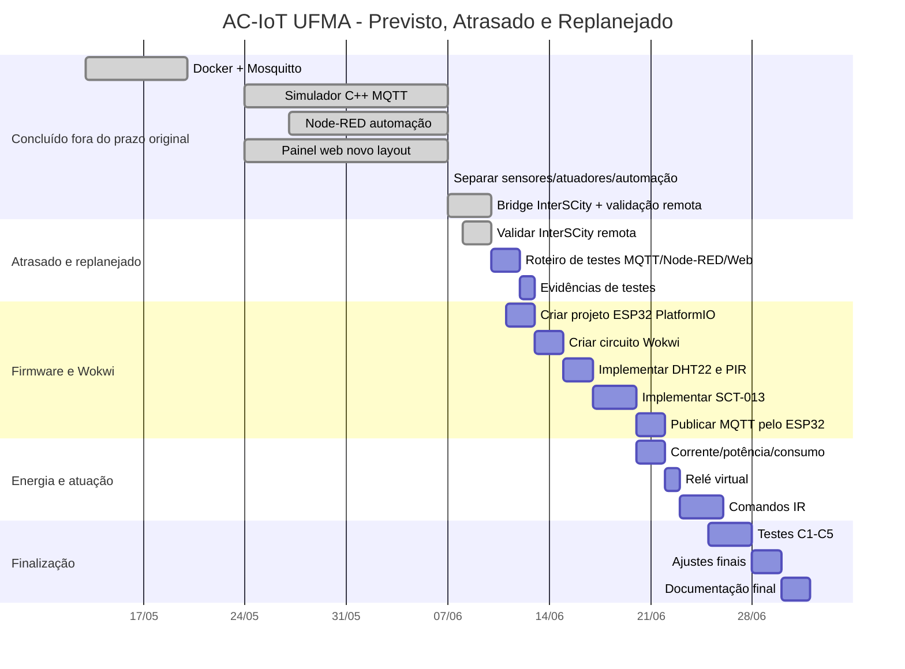

# Status de Implementação e Gantt

Atualização em: 10/06/2026.

Este documento registra o estado atual do projeto sem substituir o status/Gantt anterior.

## 1. Resumo

| Área | Status | Observação |
|---|---|---|
| Docker/Mosquitto | Concluído | Broker MQTT `1883` e WebSocket `9001` |
| Simulador C++ | Concluído para protótipo | Três salas simuladas |
| MQTT sensores/comandos | Concluído para protótipo | `ac-iot/+/sensores` e `ac-iot/+/comando` |
| Node-RED | Parcial avançado | Automação com timers estáveis |
| Painel Web | Concluído para protótipo | Novo layout operacional |
| InterSCity UFMA | Concluído | Telemetria confirmada — `[OK]` nas 3 salas em 10/06 |
| ESP32/PlatformIO | Pendente | Firmware final ainda não criado |
| Wokwi | Pendente | Circuito final ainda não criado |
| Energia/SCT-013 | Pendente | Corrente e potência ainda não implementadas |
| IR/relé | Pendente | Controle físico ainda não implementado |
| Testes formais | Parcial | Falta roteiro final com evidências |

## 2. Tabela de Implementação

| Etapa | Previsto | Status atual | Evidência | Falta |
|---|---|---|---|---|
| 01 | Ambiente Docker | Concluído | `docker-compose.local.yml` | Documentação final |
| 02 | Broker MQTT | Concluído | Mosquitto `1883/9001` | Autenticação opcional |
| 03 | Simular salas | Concluído | `src/simulator/main.cpp` | Expansão opcional |
| 04 | Sensores MQTT | Concluído | `ac-iot/+/sensores` | Corrente/potência |
| 05 | Comandos MQTT | Concluído | `ac-iot/+/comando` | Payload final padronizado |
| 06 | Automação | Parcial avançado | Node-RED | Dashboard energético |
| 07 | Presença/setpoints | Concluído para protótipo | 20s presença, 10s ausência | Testes formais |
| 08 | Painel web | Concluído | `http://localhost:8080` (Nginx) | — |
| 09 | InterSCity bridge | Concluído | `src/bridge/main.cpp` — telemetria `[OK]` | — |
| 10 | Validar InterSCity remota | Concluído em 10/06 | 3 salas confirmadas no Data Collector | — |
| 11 | ESP32 | Pendente | Não há firmware final | Criar PlatformIO |
| 12 | Wokwi | Pendente | Não há circuito final | Criar `diagram.json` |
| 13 | SCT-013/energia | Pendente | Não implementado | Corrente/potência/consumo |
| 14 | IR/relé | Pendente | Não implementado | Atuação física/simulada |
| 15 | Testes finais | Parcial | Testes manuais | Criar C1-C5 |

## 3. Gantt em Tabela

Legenda:

| Símbolo | Significado |
|---|---|
| 🟩 | Concluído dentro do período |
| 🟦 | Concluído, mas fora do prazo original |
| 🟨 | Em andamento ou previsto no novo cronograma |
| 🟥 | Atrasado: não ocorreu no prazo original |
| ⬜ | Sem atividade no período |

| Atividade | Prazo original | Nova data / status | 28/05-31/05 | 01/06-04/06 | 05/06-08/06 | 09/06-12/06 | 13/06-16/06 | 17/06-20/06 | 21/06-24/06 | 25/06-30/06 |
|---|---:|---|:---:|:---:|:---:|:---:|:---:|:---:|:---:|:---:|
| Docker + Mosquitto | 13/05-20/05 | Concluído | 🟩 | ⬜ | ⬜ | ⬜ | ⬜ | ⬜ | ⬜ | ⬜ |
| Simulador C++ MQTT | 15/05-24/05 | Concluído em 07/06 | 🟥 | 🟥 | 🟦 | ⬜ | ⬜ | ⬜ | ⬜ | ⬜ |
| Node-RED automação | 24/05-27/05 | Concluído em 07/06 | 🟥 | 🟥 | 🟦 | ⬜ | ⬜ | ⬜ | ⬜ | ⬜ |
| Painel web novo layout | 18/05-24/05 | Concluído em 07/06 | 🟥 | 🟥 | 🟦 | ⬜ | ⬜ | ⬜ | ⬜ | ⬜ |
| Separar sensores/atuadores/automação | Não previsto | Concluído em 07/06 | ⬜ | ⬜ | 🟦 | ⬜ | ⬜ | ⬜ | ⬜ | ⬜ |
| Bridge InterSCity | 28/05-03/06 | Concluído em 10/06 | 🟥 | 🟥 | 🟦 | 🟦 | ⬜ | ⬜ | ⬜ | ⬜ |
| Consulta InterSCity no painel | 28/05-03/06 | Concluído em 07/06 | 🟥 | 🟥 | 🟦 | ⬜ | ⬜ | ⬜ | ⬜ | ⬜ |
| Validar InterSCity remota | 28/05-03/06 | Concluído em 10/06 | 🟥 | 🟥 | 🟥 | 🟦 | ⬜ | ⬜ | ⬜ | ⬜ |
| Roteiro de testes MQTT/Node-RED/Web | 16/06-18/06 | Previsto | ⬜ | ⬜ | ⬜ | 🟨 | 🟨 | ⬜ | ⬜ | ⬜ |
| Evidências de testes | 18/06-20/06 | Previsto | ⬜ | ⬜ | ⬜ | ⬜ | 🟨 | 🟨 | ⬜ | ⬜ |
| Criar projeto ESP32 PlatformIO | 01/06-02/06 | Replanejado | ⬜ | 🟥 | 🟥 | 🟨 | ⬜ | ⬜ | ⬜ | ⬜ |
| Criar circuito Wokwi | 03/06-04/06 | Replanejado | ⬜ | 🟥 | 🟥 | 🟨 | 🟨 | ⬜ | ⬜ | ⬜ |
| Implementar DHT22 e PIR | 05/06-06/06 | Replanejado | ⬜ | ⬜ | 🟥 | ⬜ | 🟨 | ⬜ | ⬜ | ⬜ |
| Implementar SCT-013 | 05/06-07/06 | Replanejado | ⬜ | ⬜ | 🟥 | ⬜ | 🟨 | 🟨 | ⬜ | ⬜ |
| Publicar MQTT pelo ESP32 | 10/06-11/06 | Previsto/replanejado | ⬜ | ⬜ | ⬜ | 🟨 | ⬜ | 🟨 | ⬜ | ⬜ |
| Corrente/potência/consumo | 08/06-10/06 | Replanejado | ⬜ | ⬜ | 🟥 | 🟥 | ⬜ | 🟨 | ⬜ | ⬜ |
| Relé virtual | 10/06-12/06 | Replanejado | ⬜ | ⬜ | ⬜ | 🟥 | ⬜ | ⬜ | 🟨 | ⬜ |
| Comandos IR | 12/06-15/06 | Replanejado | ⬜ | ⬜ | ⬜ | 🟥 | 🟥 | ⬜ | 🟨 | ⬜ |
| Testes finais C1-C5 | 16/06-21/06 | Previsto | ⬜ | ⬜ | ⬜ | ⬜ | 🟨 | 🟨 | ⬜ | ⬜ |
| Ajustes finais | 21/06-23/06 | Previsto | ⬜ | ⬜ | ⬜ | ⬜ | ⬜ | ⬜ | 🟨 | ⬜ |
| Documentação final | 23/06-25/06 | Previsto | ⬜ | ⬜ | ⬜ | ⬜ | ⬜ | ⬜ | 🟨 | 🟨 |

## 4. Diagrama de Gantt

## 5. Feito

- Docker, Mosquitto, Node-RED e simulador.
- MQTT sensores e comandos.
- Automação por presença e setpoints.
- Timers estáveis: AC em 20s, ausência em 10s.
- Novo painel web.
- Eventos MQTT com rolagem.
- Sensores separados de controle direto.
- Modo de automação separado.
- Bridge InterSCity (C++ async, pipeline MQTT → HTTP).
- Validação InterSCity remota — telemetria `[OK]` confirmada nas 3 salas em 10/06.
- Refatoração completa para sistema distribuído (C++17, Docker Compose limpo).

## 6. Falta

- Criar roteiro de testes com evidências.
- Implementar ESP32/PlatformIO.
- Criar circuito Wokwi.
- Adicionar corrente, potência e energia.
- Implementar IR/relé.
- Consolidar documentação final.

---

## 7. Atualizacao complementar — 15/06/2026

Registro adicional sem substituicao do cronograma anterior.

### Concluido nesta atualizacao

- Ajuste da logica operacional de presenca:
  - luz ligada imediatamente com presenca;
  - ar-condicionado ligado apos atraso;
  - luz e ar desligados apos sala vazia por alguns segundos.
- Regra de temperatura critica revisada:
  - somente com presenca;
  - temperatura >= 130% do `setpoint_ac`;
  - ar desligado ou com setpoint alto;
  - geracao controlada em torno de 3% a 5% das salas.
- Filtro visual para exibir salas com temperatura critica.
- Escopo de comando em massa para salas com temperatura critica.
- Nova pagina `dashboard.html` com graficos e metricas do sistema.
- Instrumentacao da bridge com metricas reais Bridge -> InterSCity.
- Reorganizacao da consulta InterSCity por sala no painel **Sala Selecionada**.

### Evidencias tecnicas registradas

- Simulador medido com 33 salas criticas em 1000 salas, equivalente a 3,3%.
- InterSCity consultado via proxy web com `HTTP 200`.
- Bridge publicando `ac-iot/system/bridge_metrics`.
- Bridge enviando telemetria para InterSCity com `HTTP 201`.
- Dashboard exibindo media movel MQTT e metricas reais da bridge.

### Replanejamento imediato

- [ ] Capturar prints finais do painel operacional e dashboard.
- [ ] Consolidar evidencias de comandos MQTT, consulta InterSCity e metricas da
      bridge.
- [ ] Atualizar apresentacao somente apos congelar a versao final da interface.
